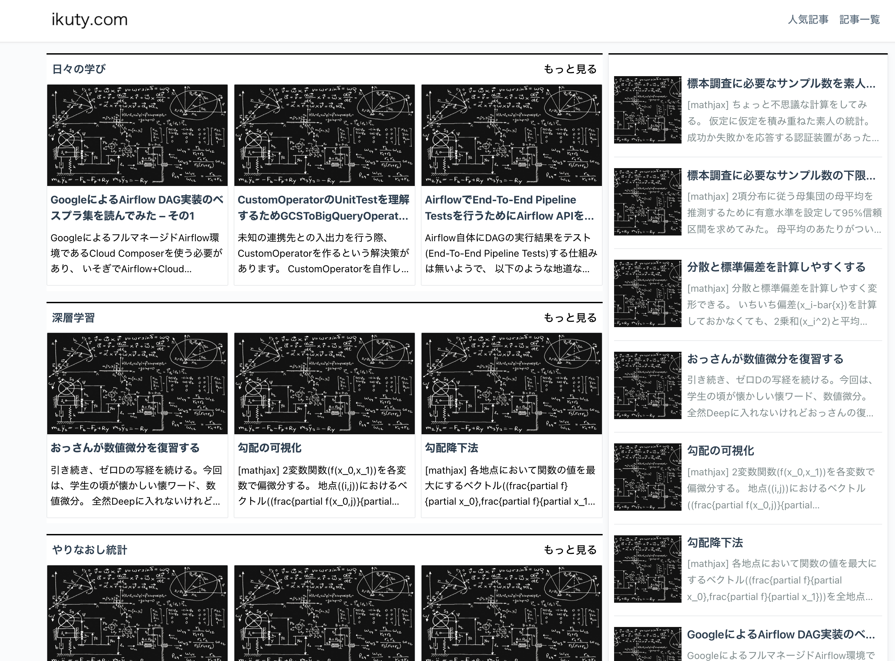

# WordPress Docker 開発環境

Underscores (_s) スターターテーマをベースにした ikuty.com風カスタムテーマを含む、Docker ベースの WordPress 開発環境です。



## プロジェクト概要

このプロジェクトは、Docker コンテナを使用した完全な WordPress 開発セットアップを提供します：

- **WordPress**: 最新の WordPress インストール
- **MySQL**: データベースバックエンド
- **phpMyAdmin**: データベース管理インターフェース
- **カスタムテーマ**: Automattic の Underscores (_s) スターターテーマをベース

## アーキテクチャ

### Docker サービス

- **wordpress**: WordPress サイト（`http://localhost:8000` でアクセス可能）
- **db**: MySQL 5.7 データベース
- **phpmyadmin**: データベース管理インターフェース（`http://localhost:8081` でアクセス可能）

### カスタムテーマ (`original-theme/`)

テーマは Underscores (_s) スターターテーマをベースに構築され、以下の機能を備えています：

- **テーマ詳細**:
  - 名前: `original-theme`
  - テキストドメイン: `original-theme`
  - 関数プレフィックス: `original_theme_`

- **主要機能**:
  - フローティングソーシャルシェアバナー（X/Twitter、Bluesky、Facebook、はてな）
  - カスタムデータベーステーブルによる投稿ビュー追跡
  - 人気投稿機能
  - カスタムショートコード（`[arst_toc]`、`[all_topics]`、`[popular_topics]`）
  - コードブロック用の Prism.js シンタックスハイライト
  - 最適化のためのカスタム画像サイズ
  - RTL 言語サポート

## はじめに

### 前提条件

- Docker と Docker Compose
- Node.js（テーマ開発用）
- Composer（PHP 依存関係用）

### インストール

1. リポジトリをクローン:
```bash
git clone <repository-url>
cd wordpress-docker
```

2. Docker 環境を開始:
```bash
docker-compose up -d
```

3. WordPress サイトに `http://localhost:8000` でアクセス
4. phpMyAdmin に `http://localhost:8081` でアクセス

### データベース認証情報

- **ユーザー名**: `wordpress`
- **パスワード**: `wordpress`
- **データベース**: `wordpress`

## テーマ開発

開発のためにテーマディレクトリに移動:

```bash
cd original-theme/
```

### CSS/Sass 開発

```bash
npm run watch          # Sass ファイルを監視して自動コンパイル
npm run compile:css    # Sass を CSS にコンパイル（リント付き）
npm run compile:rtl    # RTL スタイルシートを生成
```

### コード品質

```bash
npm run lint:scss      # Sass ファイルをリント
npm run lint:js        # JavaScript ファイルをリント
composer lint:wpcs     # WordPress コーディング規約に対して PHP をチェック
composer lint:php      # PHP 構文エラーをチェック
```

### 国際化

```bash
composer make-pot      # .pot 翻訳ファイルを生成
```

### 配布

```bash
npm run bundle         # 配布用 zip ファイルを作成
```

## テーマ機能

### フローティングソーシャルシェアバナー

テーマには、単一投稿ページにフローティングソーシャルシェアバナーが含まれています：

- **X (Twitter)**: タイトル、URL、@tw_ikuty 経由で投稿をシェア
- **Bluesky**: タイトルと URL で投稿をシェア
- **Facebook**: 投稿 URL をシェア
- **はてな**: URL とタイトルで投稿をブックマーク

### カスタムショートコード

- `[arst_toc tag="h2"]`: 指定された HTML タグの目次を生成
- `[all_topics count="10"]`: ページネーション付きで最新投稿を表示
- `[popular_topics count="10"]`: 最も閲覧された投稿を表示

### 投稿ビュー追跡

テーマには、カスタム投稿ビュー追跡システムが含まれています：

- カスタム `wp_pvs` テーブルで投稿ビューを追跡
- 管理者ユーザーと重複セッションビューを除外
- ビューカウント表示用の関数を提供
- 投稿リストでのビューカウント用管理者カラム

## ファイル構造

```
original-theme/
├── css/                    # コンパイル済み CSS ファイル
├── img/                    # テーマ画像
├── inc/                    # テーマインクルード
├── js/                     # JavaScript ファイル
├── sass/                   # Sass ソースファイル
├── template-parts/         # テンプレートパーツ
├── functions.php           # テーマ関数
├── style.css              # メインスタイルシート
└── single.php             # 単一投稿テンプレート
```

## 開発ノート

- テーマファイルは Docker コンテナに直接マウントされ、ライブ編集が可能
- テーマは HTML5 マークアップとカスタムロゴをサポート
- ナビゲーションメニューとウィジェットエリアは事前設定済み
- Jetpack 互換性が含まれています
- カスタムヘッダーと背景をサポート

## 貢献

1. WordPress コーディング規約に従うことを確認
2. コミット前にリントツールを実行
3. Docker 環境で機能をテスト
4. 必要に応じてドキュメントを更新

## ライセンス

このプロジェクトは Underscores スターターテーマをベースにしており、同じライセンス条項に従います。